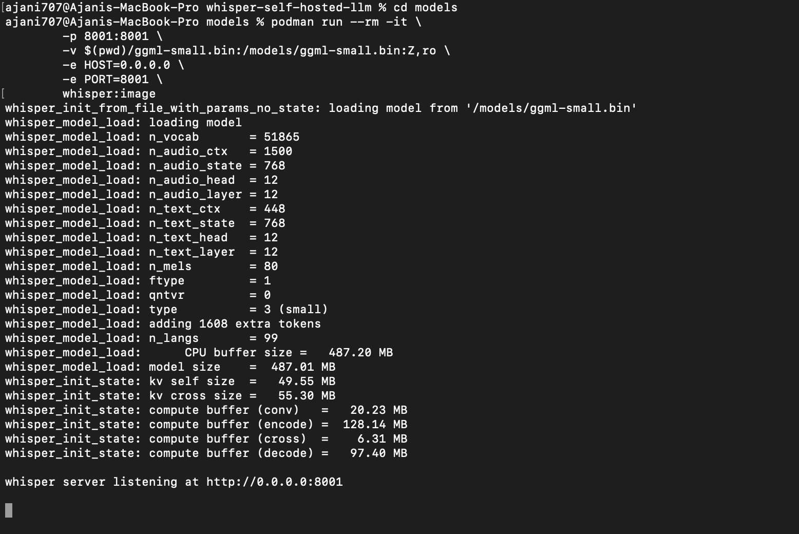
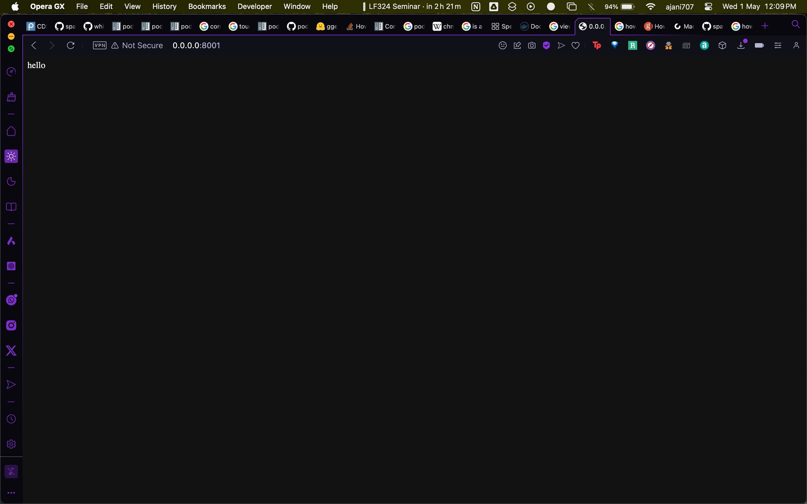
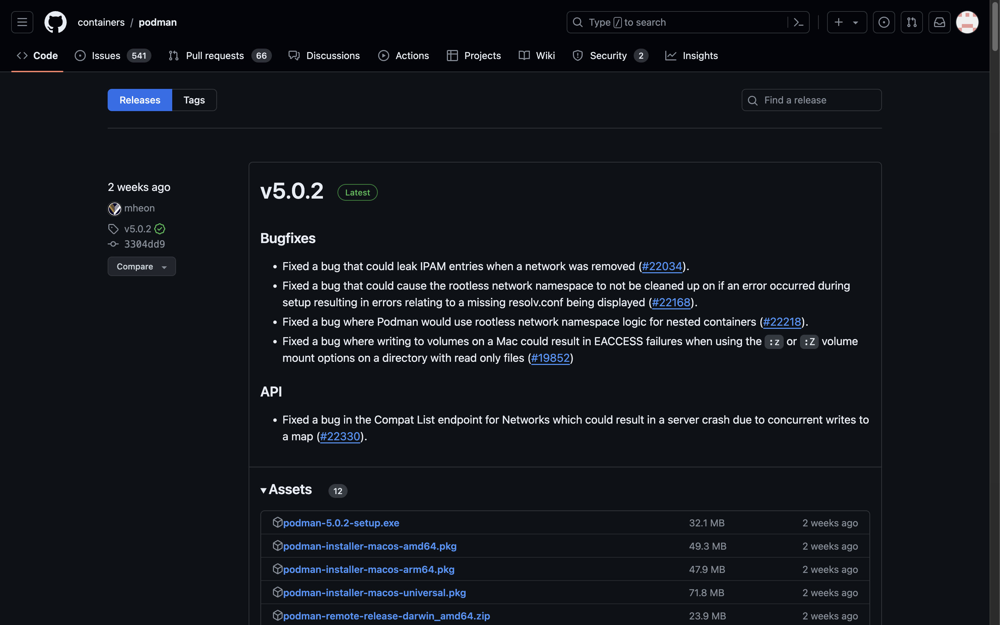
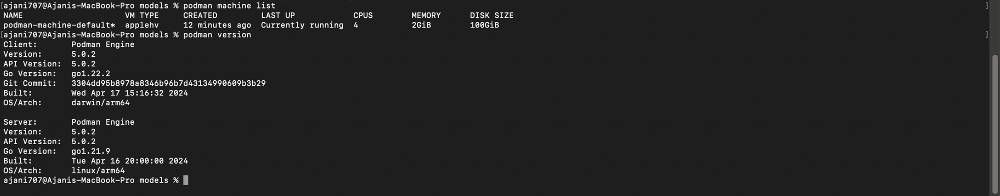
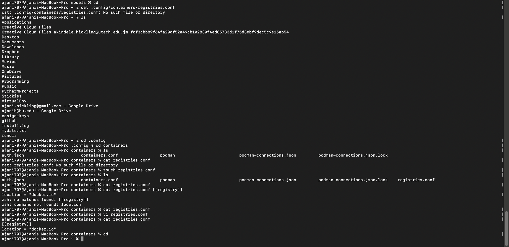
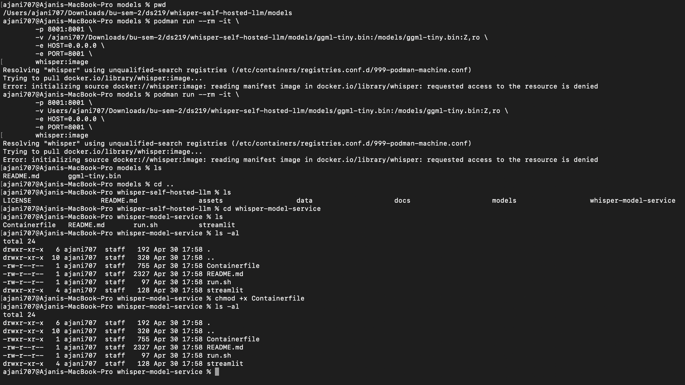
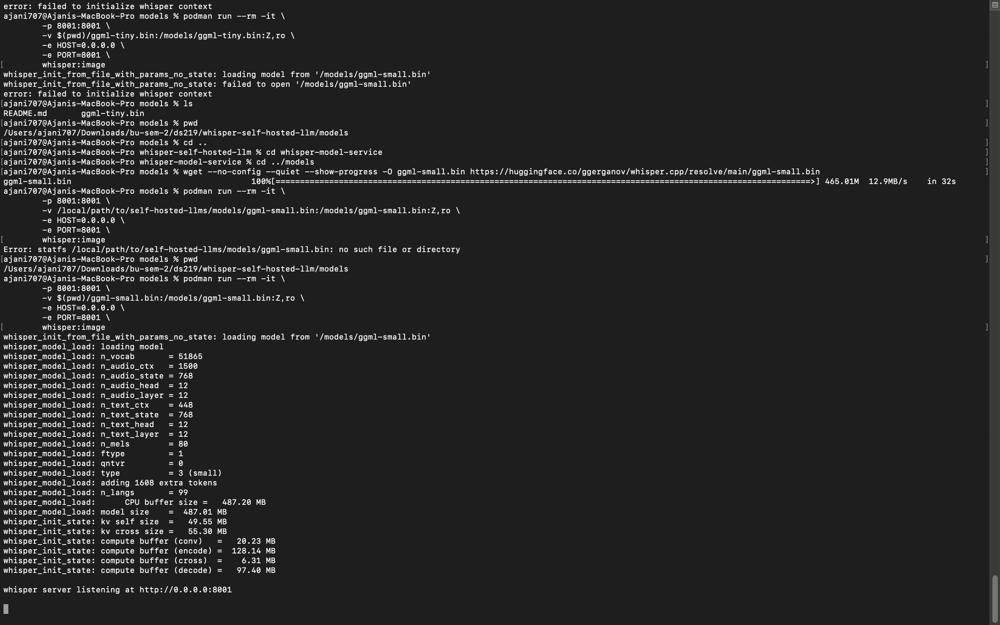
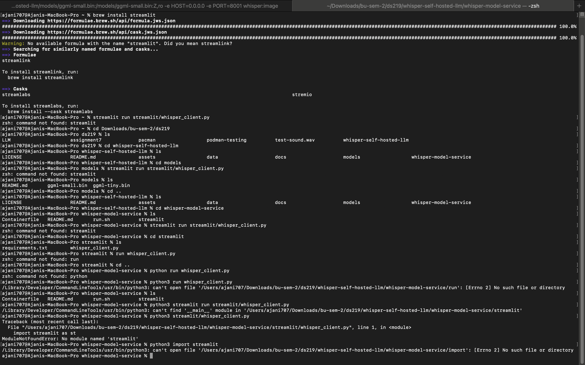
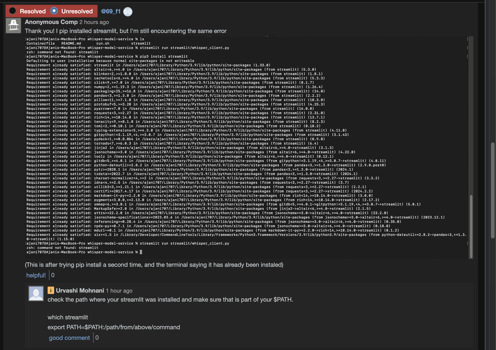
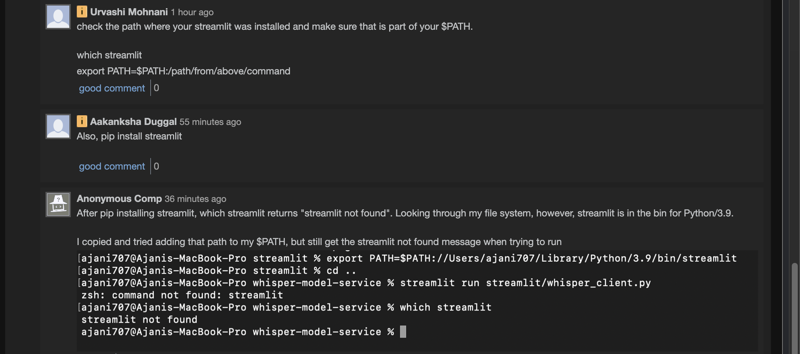

# Assignment 8
**Ajani Hickling, @42-Life on GitHub**

## Terminal Screenshot: Whisper Server Hosted on Machine 

## Screenshot of Local Host

I was unable to get Streamlit to run (described below), but I was able to open the server on my local host.

---

# Description of Process & Challenges
### Storage & Setup
* I cleared space on my machine to ensure I would have space for the models, since this had been an issue during the in-class practice.
* I followed the necessary steps, adjusting the containers.conf file to ensure my VM type was applehv.

### Podman Versions
* I had Podman Desktop version 4.9.1, which I had previously installed using brew.
* I deleted the application, and redownloaded from the Podman site--with the intention of getting Podman 5.0, as advised during class. 
* After re-downloading, Podman Desktop indicated that it was version 4.9.2
* I deleted once again, and returned to the Podman website. This time, I clicked **"latest stable release"**, which directed me to a podman github repo

* I downloaded once more, using the "podman-installer-macos-universal.pkg" option. 
* After downloading, I realised that this installation gave me podman on command line only, with no Desktop interface. I figured this would not be a significant problem, and would allow me to better practice using the terminal commands.

I initialised a new podman machine, and now had Podman 5.0.2

### Model Deployment Issues
* I continually received errors at the model deployment stage.
* I made a Piazza post, and a classmate pointed out that I had not replaced a file path. I corrected this, and was still getting the same error -- regarding resource access permissions.
* I analysed the error message, and figured that since containerfiles are executables in a way, that maybe the issue was with the permissions. I used ls-al in the whisper-model-service directory and saw that the container file only had read and write access. I used chmod +x to give executable access as well.

* The issue persisted, and I went online, searching the error for both Docker and Podman. Forums said that logging into Docker was necessary, so I did that through terminal. Another mentioned a registry.conf file, so I created and added one to .config. However, the model would still not deploy.

* I realised the next day that I had accidentally skipped the "build" step. I completed that, and this error was resolved.

* NB: I was using the ggml-tiny model initially, to be conscious of my space. At this point, I had resolved my previous issues with model deployment, but when trying to deploy the model, I got an error message that alluded to trying to run ggml-small instead. I downloaded ggml-small through command line to circumvent this issue, and the model deployed after that point. 

### Streamlit Issues

* Now that the Whisper server was running, I opened a new window to run Streamlit, since I could no longer enter commands in this terminal window
* The *streamlit run streamlit/whisper_client.py* command would not run. I tried to brew install streamlit, and brew said there was no such package to download. I tried to pip install it, and my terminal said pip was not found.
* I used pip3 instead, and streamlit was downloaded. However, when I tried to run the command, terminal would output "streamlit not found"

### Streamlit & Pip
* I created a Piazza post inquiring about the issue.
* I confirmed that streamlit had been downloaded. I explored my file system and noted that the streamlit executable was in **/Users/ajani707/Library/Python/3.9/bin/streamlit** and not **usr/bin**. 
* I tried to move the file, both in the GUI and the CLI, but the action was denied in both instances.
* I added the file path of streamlit to the $PATH environment variable. I ran **echo $PATH**, which showed that the streamlit path was a part of $PATH. Despite this, when I tried running the command, the terminal output "streamlit not found"
* I tried running the whisper_client.py file using python3 directly, which gave a different error: that the __ main __ module was not found.

### Finishing
I did not end up resolving the issue in time for the deadline. I resolved my issues with podman and mdoel deployment, and recorded an audio for the presentation, but could not get the streamlit UI to function to be able to test the model properly.